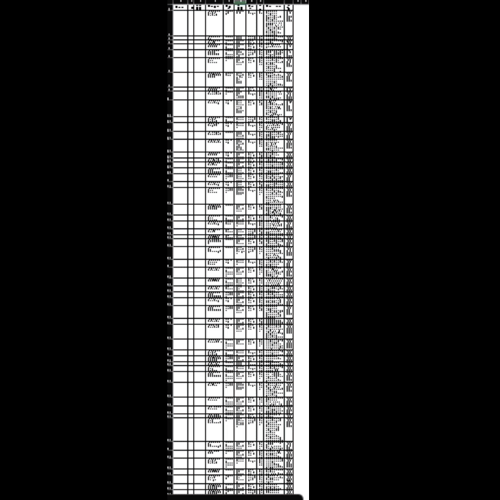

# DanDan's Work Solutions

> This project consists of several smaller projects intended to help my wife out with eliminating repetitive tasks. Tasks will vary but will mainly consist of Excel and VBA for scripting automation. Thank you for coming by :)


## 📦Features
 ✅ Check out my awsome features!
- ### ✅📄 Highlight Daily Region Report
  - Automate highlighting of rows depending on row values. Wife was tired of manually scanning the document and manually highlighting each row depending on its content. A macro has been created to automate the process eliminating an hours worth of work.
  - [Source code](https://github.com/mac46005/dandans_worksolutions/blob/main/DailyRegionReport/HighlightDailyReport.cls)
- ### 🚧Transfer Notes In Reports
  - 
## 📸 Screenshots

| Feature | Screenshot |
|---------|------------|
| Highlight Daily Region Report |  |

## 🛠️ Build With

- [Microsoft Excel](https://www.microsoft.com/en-US/microsoft-365/excel)
- [Visual Basic For Applications](https://learn.microsoft.com/en_us/office/vba/library-reference/concepts/getting-started-with-vba-in-office)

<!-- ## 🧰 Installation -->

<!-- '''bash
# Clone the repo
git clone https://github.com/your-username/project-name.git

# Go into the project folder
cd project-name
``` -->
<!-- # Install dependencies
npm install

## Run the app
npm start

## 🧪 Usage / Examples

```bash
# Example command
myapp --flag "value"
```

## 🧩 Project Structure

```
project-name/
├── src/
│   └── ...
├── public/
│   └── ...
├── README.md
└── ...
├
	  
```

📂 Folder Descriptions
--->
## 📅 Roadmap

### 03/11/2025—Highlight Daily Report


<!-- - Add feature A
- Add unit tests
- Polish UI for mobile -->

## 🤝 Contributing

Contributions are welcome! Please open an issue or submit a pull request.

## 🧾 License

This project is licensed under the MIT License.

## 📬 Contact

Created by **Marco Preciado** – feel free to reach out!
